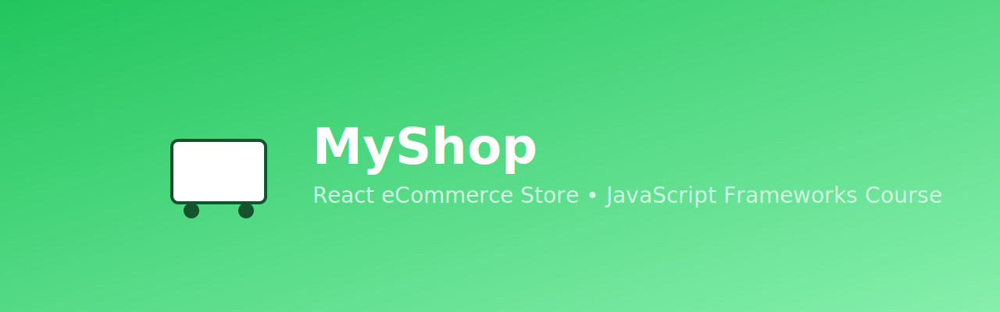
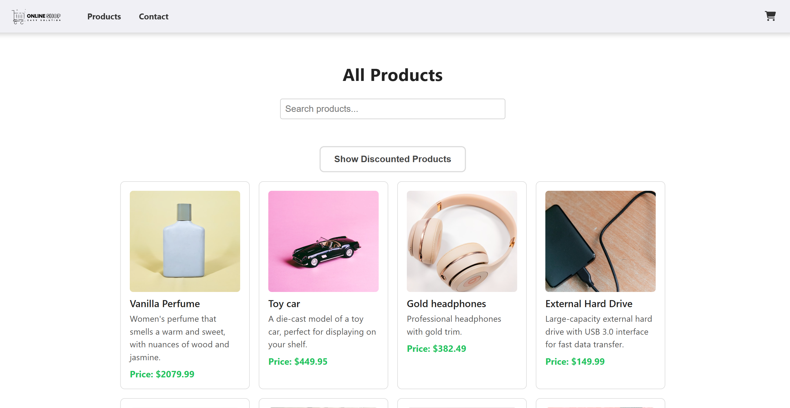
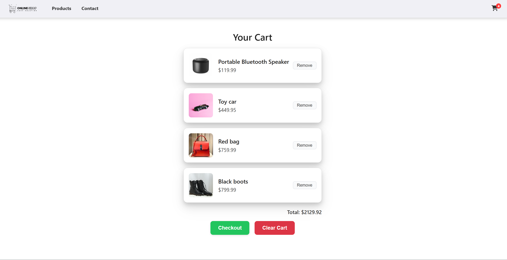
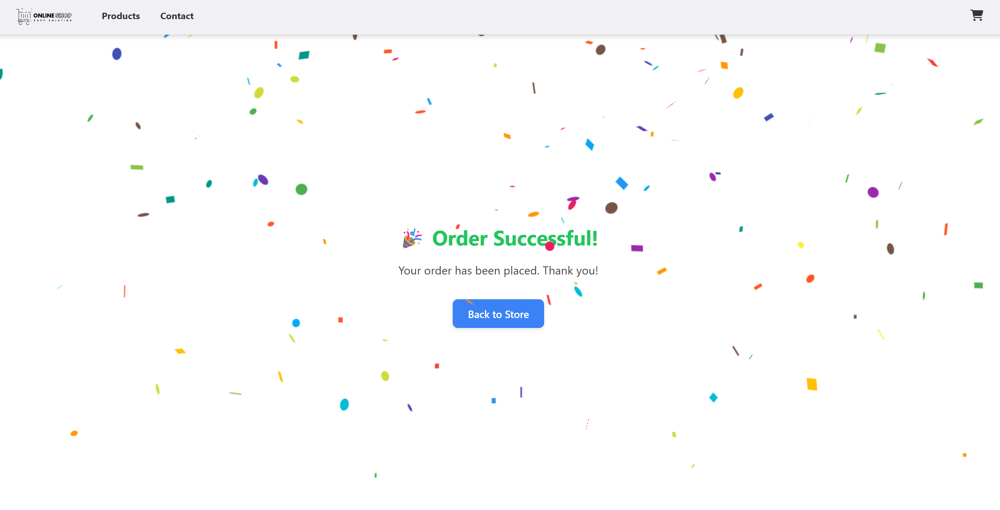

<p align="center">
  
</p>

# 🛍️ MyShop – React eCommerce Store

<p align="left">
  <a href="https://react.dev/">
    
  </a>
  <a href="https://sirakshop.netlify.app">
    
  </a>
  <a href="https://nodejs.org/">
    
  </a>
  <a href="./LICENSE">
    
  </a>
  <a href="https://github.com/si-rak/jsfw">
    
  </a>
</p>

A modern, responsive **eCommerce frontend** built with **React**, designed to simulate a real shopping experience using the **Noroff Online Shop API**.  
This project was created as part of the _JavaScript Frameworks_ course in the **Frontend Development program at Noroff**, focusing on reusable components, responsive UI, and clean architecture.

---

## ✨ Features

- 🛒 Product listing with live API fetch
- 🔍 Search and discount filter
- 📄 Product detail pages
- ➕ Add to cart and manage cart items
- 💳 Checkout confirmation page with confetti animation
- 📬 Contact form with input validation
- 📱 Fully responsive (mobile, tablet, desktop)
- 🧩 Modular components and context-based state management
- 🧪 Basic Jest testing for utility logic

---

## 🖼️ Screenshots

<div align="center">

<table>
  <tr>
    <td align="center"><b>🏠 Homepage</b></td>
    <td align="center"><b>🛒 Cart Page</b></td>
    <td align="center"><b>🎉 Checkout Success</b></td>
  </tr>
  <tr>
    <td></td>
    <td></td>
    <td></td>
  </tr>
</table>

</div>

---

## 🧰 Tech Stack

- **React** (Hooks & Context API)
- **React Router DOM v7**
- **CSS Modules**
- **Font Awesome**
- **Noroff API**
- **React Confetti**
- **Jest** (for utility testing)
- **Netlify** (for deployment)

---

## 📁 Project Structure

```text
src/
├── assets/              # Static images and logos
├── cart/                # Cart context and reducer logic
├── components/          # Reusable UI components
├── pages/               # Page-level components (Home, Product, Cart, etc.)
├── utils/               # Utility functions and tests
├── App.js               # App routes
├── index.js             # Root render with CartProvider
└── index.css            # Global styles

public/                  # Public assets and base HTML
screenshots/             # README images

```

---

## ⚙️ Installation

Clone the repository and set up the project locally with the following commands:

```bash
# Clone the repository
git clone https://github.com/si-rak/jsfw-react-myshop.git

# Navigate to the project folder
cd jsfw

# Install dependencies
npm install

# Start the local development server
npm start

```

Requires Node.js v20 (LTS recommended)
Tested successfully on Node v20 and npm 10+

---

## 🧪 Usage

1. Visit `/` to browse products
2. Use the search bar or toggle “Show Discounted Products”
3. Add items to your cart and view totals
4. Checkout to see the confetti success screen 🎉
5. Send messages via the contact form (includes validation)

---

## 🔮 Future Improvements

- 💳 Integrate Stripe or PayPal checkout
- 🔐 Add user login & authentication
- ⭐ Include product ratings & reviews
- ⚙️ Improve error handling & loading states
- 🧪 Extend Jest test coverage

---

## 👤 Author

**Sirak Getachew**  
Frontend Developer Student @ Noroff

- 🧑‍💻 [GitHub](https://github.com/si-rak)
- 💼 [LinkedIn](https://linkedin.com)
- 🌐 [Portfolio](https://portfolio-link.com)

---

## 📄 License

This project is licensed under the [MIT License](LICENSE).  
© 2025 Sirak Getachew. All rights reserved.

---

## 🙏 Acknowledgements

Thanks to **Noroff School of Technology** and the **Frontend Development staff** for their guidance and support.  
Special thanks to **Martin** for valuable mentorship and feedback.  
UI inspiration from [this YouTube video](https://youtu.be/054qYbsxyXw?si=4MmrgCzNIloRdTVV).  
Some refinements were made with help from **ChatGPT**, used for learning and troubleshooting.

---

## 🌐 Live Demo

[🟢 View Site on Netlify](https://jsfw-react-myshop.netlify.app/)

## 💻 GitHub Repository

[📂 View Source Code on GitHub](https://github.com/si-rak/jsfw-react-myshop.git)
